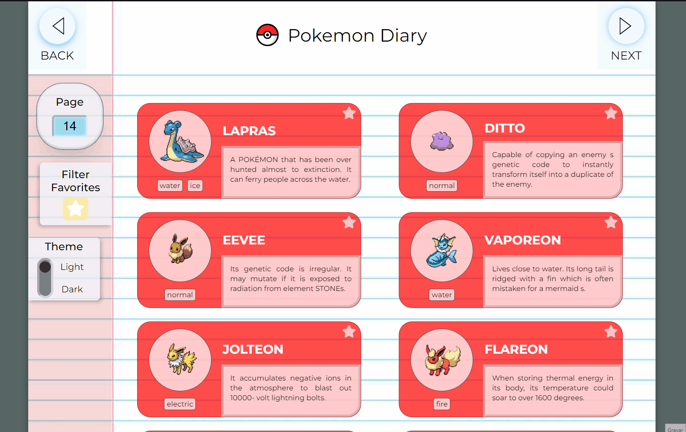
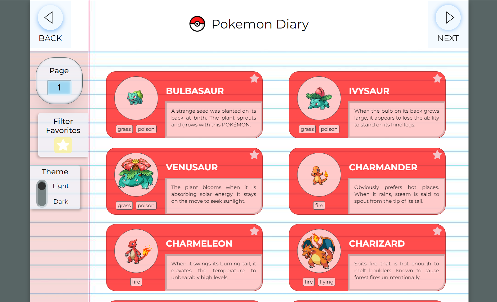
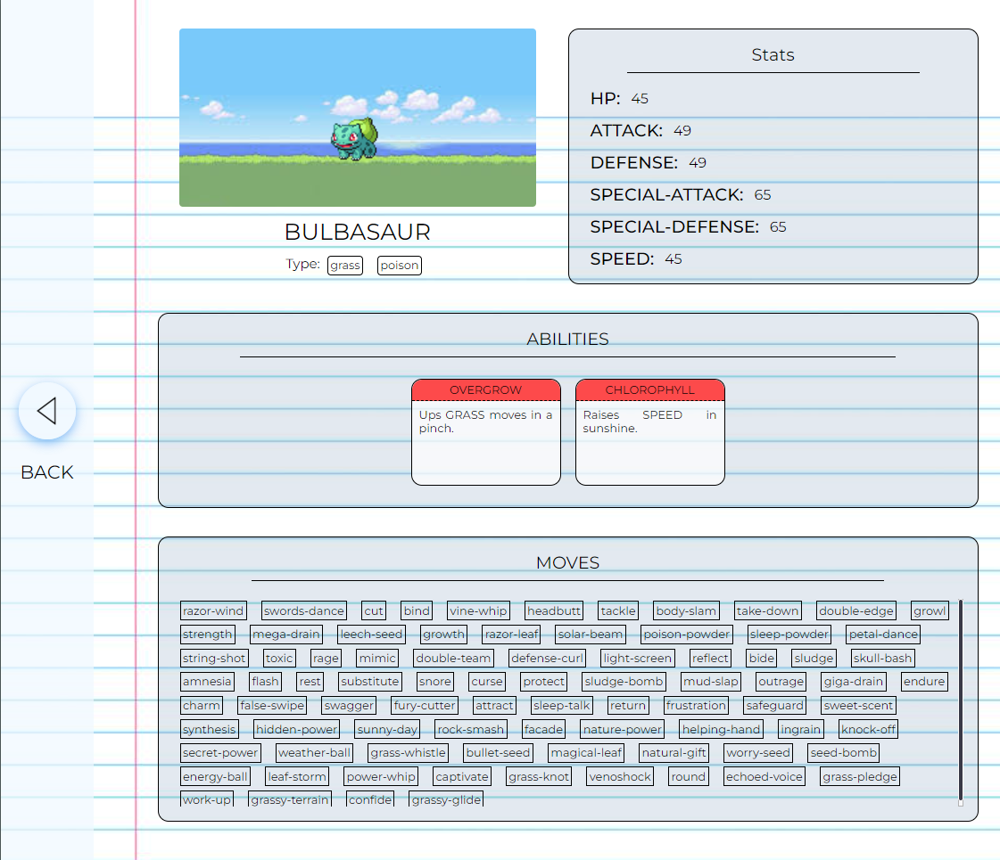
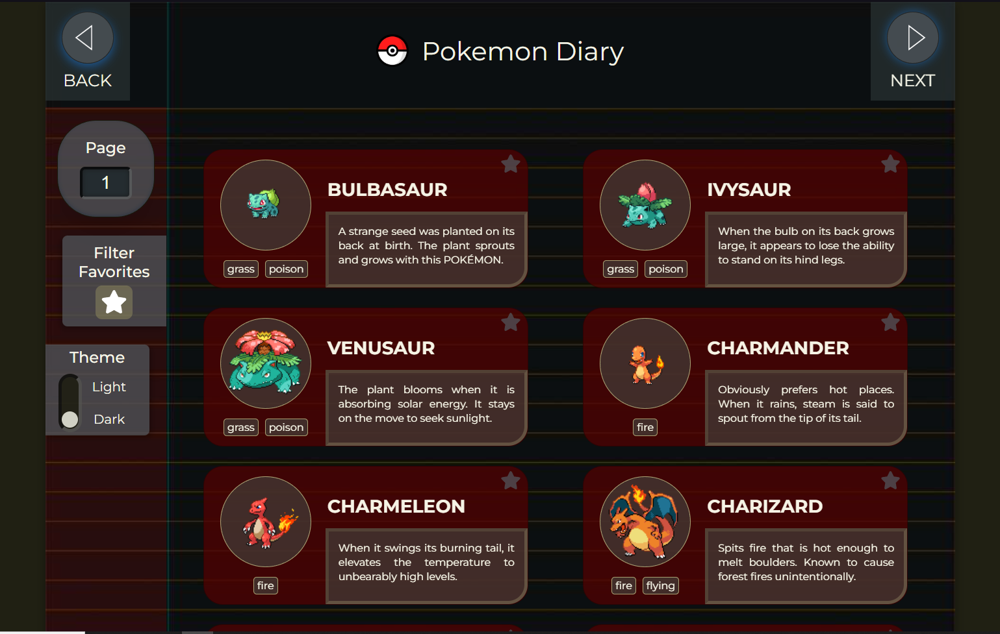
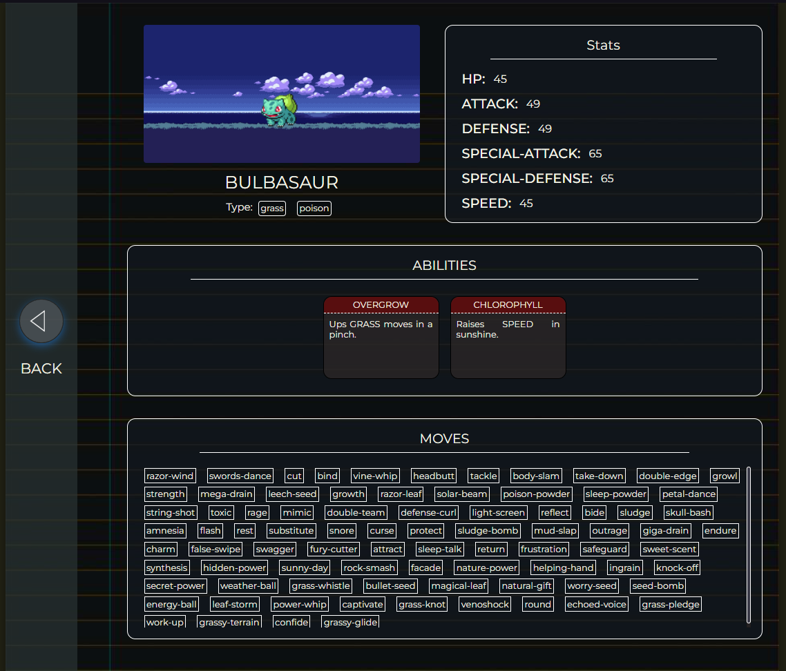
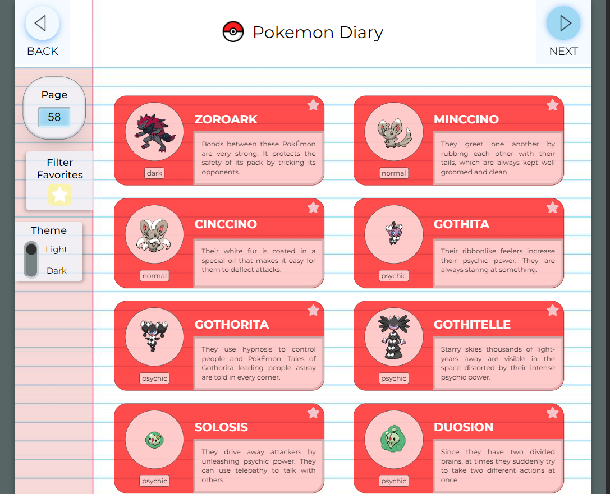
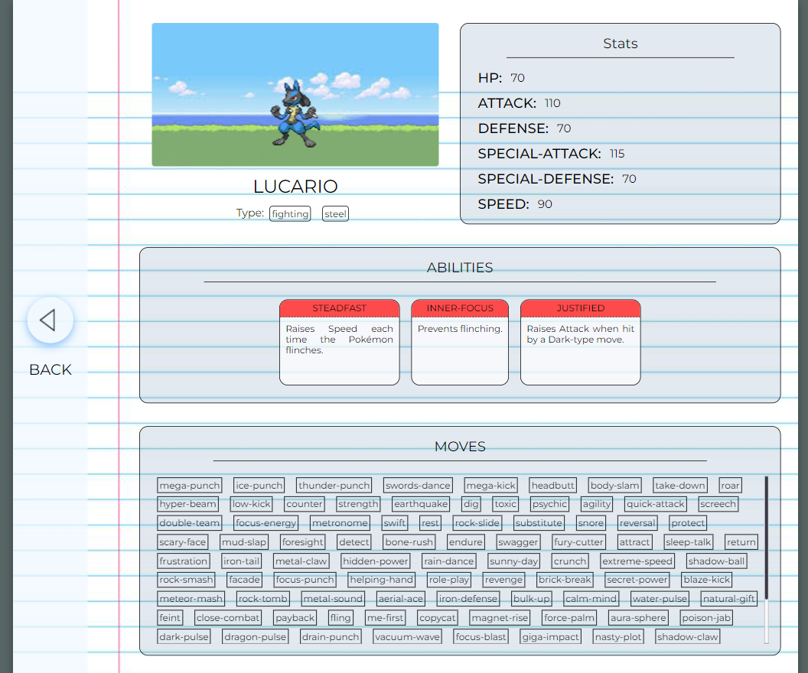
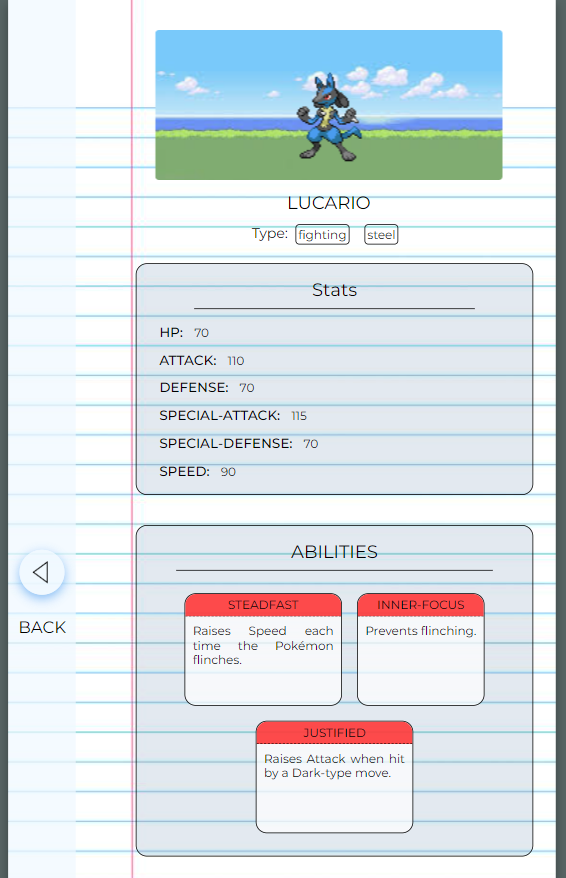
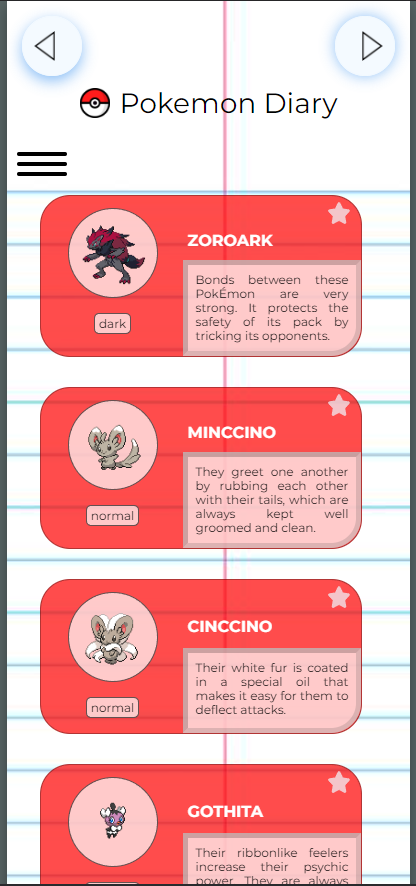
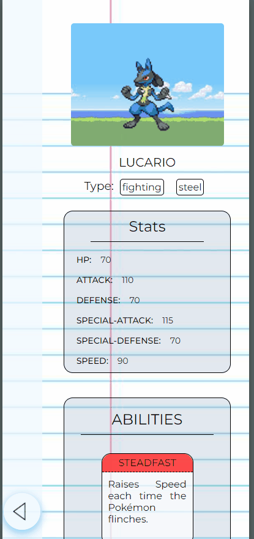

# My Pokémon Journal

This is a solution to the Quest of the "React Advanced" module of "Dev Quest" course.

## Table of contents

- [Overview](#overview)
  - [The challenge](#the-challenge)
  - [Screenshot](#screenshot)
  - [Links](#links)
- [My process](#my-process)
  - [Built with](#built-with)
  - [What I learned](#what-i-learned)
  - [Continued development](#continued-development)
  - [Useful resources](#useful-resources)
- [About the Author](#about-the-author)
- [Acknowledgments](#acknowledgments)

## Overview

### The challenge

The challenge was to build an application using the "Pokémon API", where the users can see basic informations about the Pokémons and more detailed infos when clicking on one of them. 

Users should be able to:

- Navigate through a list of Pokémons, showing them on group of 10 (when possible), being able to go back and foward on that list; 
- View the optimal layout for each of the website's pages depending on their device's screen size;
- See hover states for all interactive elements on the page;
- Toggle through "dark" and "light" themes, saving the latest choice on local storage;
- Select the favorites Pokémons and undo this choice;
- Choose to show only the favorites Pokémons on display;
- Navigate through any page of the list, using the input field.

### Screenshot

- Project Overview

- hovers

- Light Theme

- Dark Theme

- Laptop View

- Tablet View

- Mobile View

### Links

- Repository URL: [https://github.com/matheus-alopes/my-pokedex](https://github.com/matheus-alopes/my-pokedex)
- Live Site URL: [https://matheus-alopes.github.io/my-pokedex](https://matheus-alopes.github.io/my-pokedex)

## My process

### Built with

- Vite
- React JSX Components
- React Hooks
- Styled Components
- Context API
- React Router Dom
- Flexbox
- Grid
- Javascript
- DOM manipulation
- Local Storage Property
- Fetch API

### What I learned

Through this project I could practice a LOT of things of what is needed to know as a frontend software engineer. I had so many problems to learn how to solve on this one, that it was almost a course on a project. Just some things I exhaustively worked with in this project: build jsx components; work with react hooks; use css to customize components with styled components; create css variables to toggle themes; save informations on local storage; pass data through the entire application as a context (context API); manipulate the components size and positions with my css knowledge; work with routes (and passing parameters to pages inside the application) etc.

### Continued development

Talking about the future, I really hope I can become able to develop rentable projects with private undertakings. Perhaps it gonna take really long, since I gonna have to take a time off, for personal reasons. But it is not a cabal "good bye"... I love programming and I aim to climb this ladder again.

### Useful resources

- [My Frontend Summary](https://just-patch-a6b.notion.site/Resumo-De-Aulas-do-DevQuest-4092469f5cb04a3a913b87cd3d7601b4) - Those are the notes (they are in Portuguese) I made about the classes I watched on the "Dev em Dobro" online training, for Frontend dev formation

## About the Author

I'm just a guy trying hard to learn how to programm and make this a carreer.
- GitHub - [matheus-alopes](https://github.com/matheus-alopes)
- Discord - [@Malopes#5389](https://discord.com/channels/@Malopes#5389)
- Frontend Mentor - [@matheus-alopes](https://www.frontendmentor.io/profile/matheus-alopes)

## Acknowledgments

Thanks for all the "Dev Quest" teachers and staff, for your great support and tireless atttention.
